# 🌍 EarthReGen

> **AI-Powered Land Regeneration Platform** - Restoring degraded lands with data-driven insights, satellite monitoring, and carbon credit tracking.

[](https://earth-re-9yczcvrom-kimberlys-projects-b38013d9.vercel.app/)
[](https://github.com/Kimberly-ops177/EarthReGen)
[](https://supabase.com)

---

## 📖 Overview

**EarthReGen** is a comprehensive platform designed to help farmers, land managers, and environmental organizations restore and monitor degraded lands. Using AI-powered soil analysis, satellite-based vegetation monitoring (NDVI), and carbon credit tracking, EarthReGen makes land regeneration accessible, measurable, and profitable.


### 🎯 Key Features

- 🔬 **AI Soil Analysis** - Upload soil images for instant health assessment using Claude AI
- 🛰️ **NDVI Tracking** - Monitor vegetation health via satellite data
- 💰 **Carbon Credits** - Calculate and track carbon sequestration potential
- 📊 **Project Dashboard** - Real-time metrics and progress visualization
- 💳 **Financial Management** - Track expenses and potential revenue
- 👥 **Team Collaboration** - Multi-user project management
- 🚨 **Smart Alerts** - Automated notifications for critical conditions
- 📈 **Progress Reports** - Generate comprehensive regeneration reports

Homepage
<p align="center"> 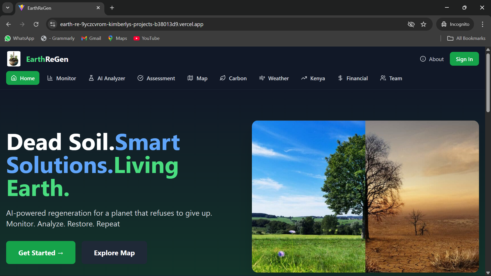 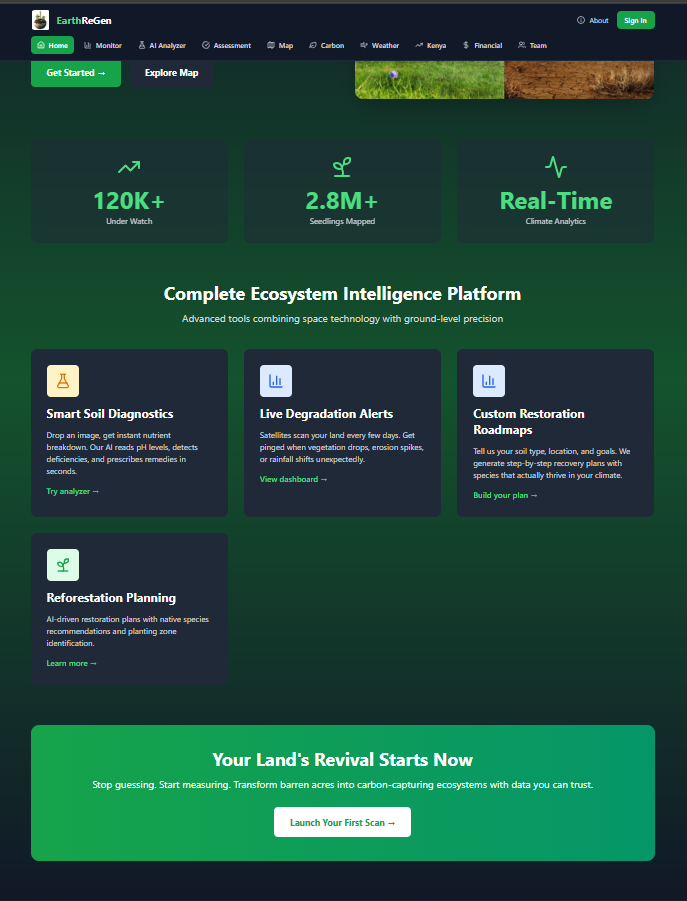 </p>

EarthReGen Icon
<p align="center"> 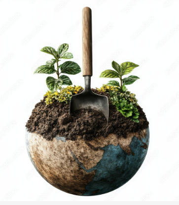 </p>

Dashboards & Insights
<p align="center"> 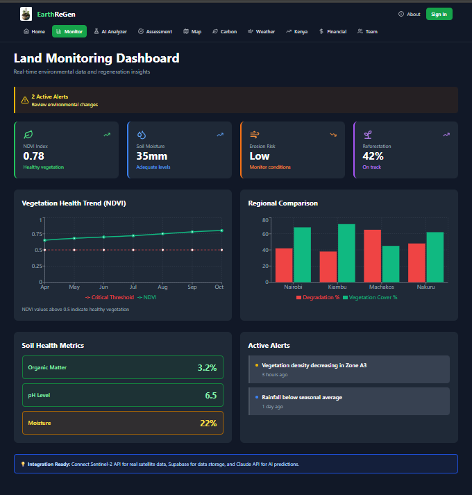 </p>

AI Analyzer Page
<p align="center">
  
</p>

Land assessment and Reneration planning
<p align="center">  </p>

Maps Page
<p align="center">
  
</p>

Carbon Tracking
<p align="center"> 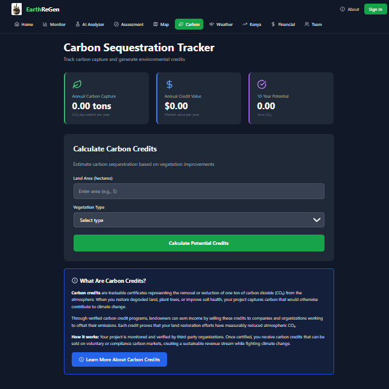 </p>

Weather Page
<p align="center"> 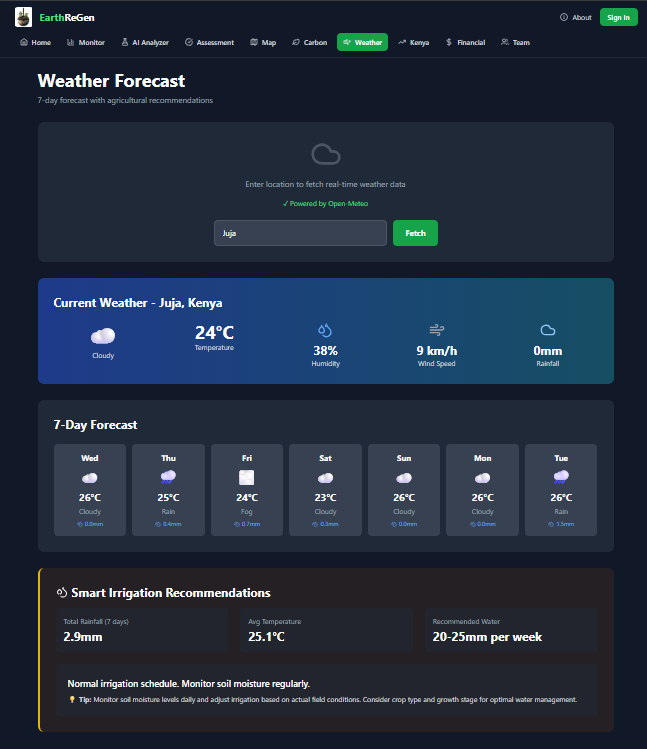 </p>

Kenya Counties and Crops Insights Page
<p align="center"> 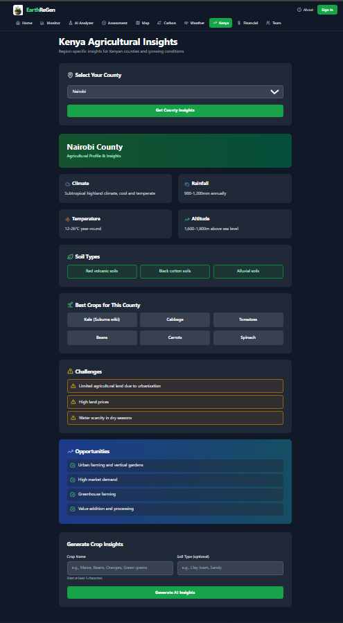 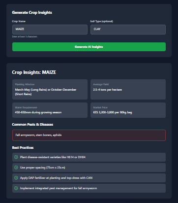 </p>

Financial Page
<p align="center">
  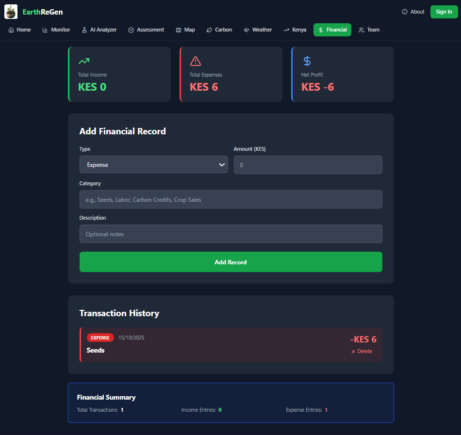 </p>

Teams
<p align="center"> 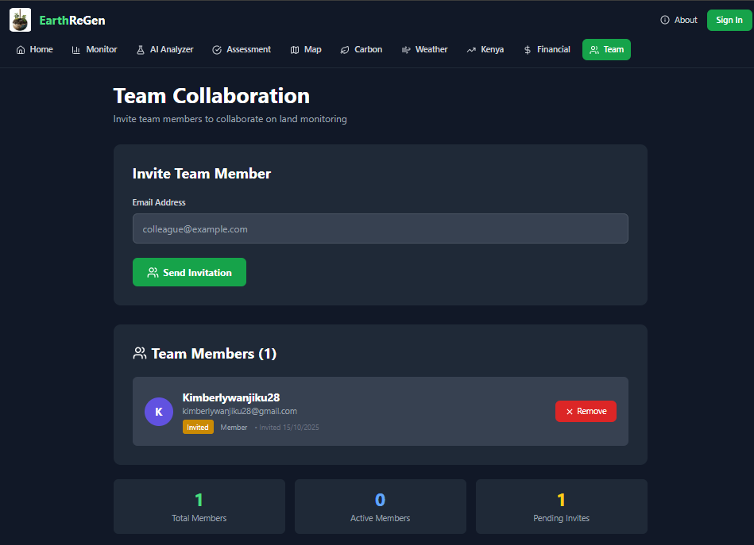 </p>

Authentication Pages
<p align="center"> 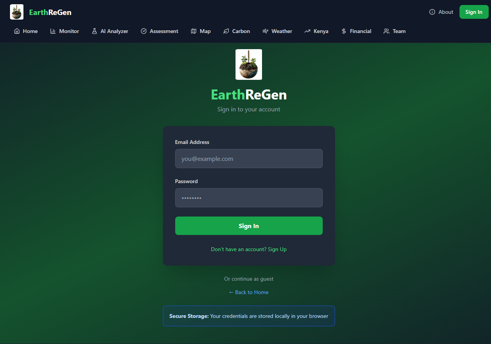 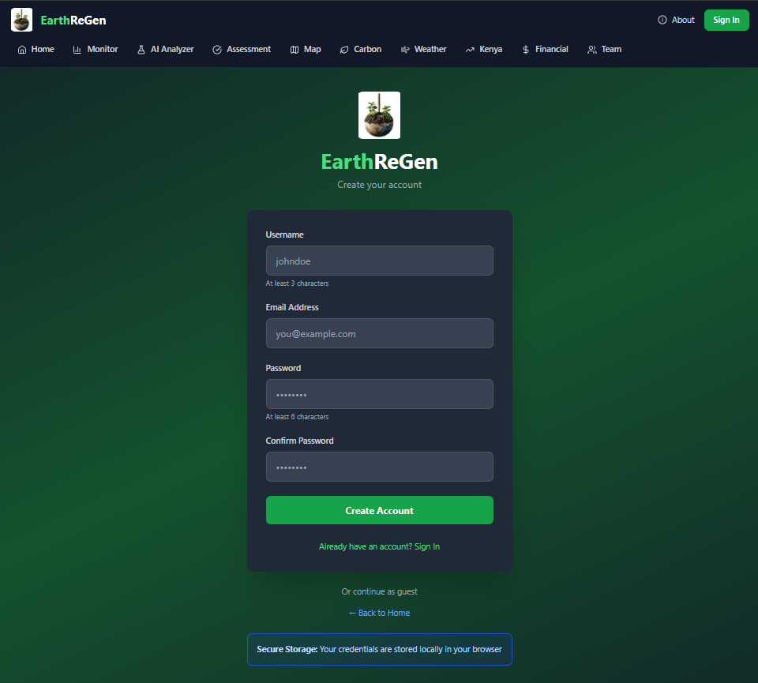 </p>

---

## 🚀 Live Deployment

| Service | URL | Status |
|---------|-----|--------|
| **Frontend** | [earth-re-9yczcvrom-kimberlys-projects-b38013d9.vercel.app](https://earth-re-9yczcvrom-kimberlys-projects-b38013d9.vercel.app/) | ✅ Live |
| **Backend** | [dhtnpctdtijnjmgzymqs.supabase.co](https://dhtnpctdtijnjmgzymqs.supabase.co) | ✅ Live |
| **Repository** | [github.com/Kimberly-ops177/EarthReGen](https://github.com/Kimberly-ops177/EarthReGen) | ✅ Public |

---

## 🛠️ Tech Stack

### **Frontend**
- ⚛️ **React 18** - Modern UI framework
- ⚡ **Vite** - Lightning-fast build tool
- 🎨 **Tailwind CSS** - Utility-first styling
- 📊 **Recharts** - Data visualization
- 🎭 **Lucide React** - Beautiful icons

### **Backend**
- 🗄️ **Supabase** - PostgreSQL database + Auth + Storage
- 🔐 **Row Level Security (RLS)** - Secure data access
- ⚡ **Edge Functions** - Serverless API endpoints
- 🤖 **Claude AI** - Advanced soil analysis

### **DevOps**
- 🚀 **Vercel** - Frontend deployment
- 📦 **Git** - Version control
- 🔧 **npm** - Package management

---

## 📋 Prerequisites

Before you begin, ensure you have:

- **Node.js** (v18 or higher) - [Download](https://nodejs.org/)
- **npm** (v9 or higher) - Comes with Node.js
- **Git** - [Download](https://git-scm.com/)
- **Supabase Account** - [Sign up](https://supabase.com)
- **Claude API Key** - [Get one](https://console.anthropic.com/)
- **Vercel Account** (for deployment) - [Sign up](https://vercel.com)

---

## 🚀 Quick Start

### 1. Clone the Repository

```bash
git clone https://github.com/Kimberly-ops177/EarthReGen.git
cd EarthReGen
```

### 2. Install Dependencies

```bash
npm install
```

### 3. Set Up Environment Variables

Create a `.env.local` file in the root directory:

```env
VITE_SUPABASE_URL=your_supabase_project_url
VITE_SUPABASE_ANON_KEY=your_supabase_anon_key
VITE_CLAUDE_API_KEY=your_claude_api_key
```

**Get your credentials:**
- **Supabase**: Dashboard → Settings → API
- **Claude**: [console.anthropic.com](https://console.anthropic.com/)

### 4. Run Development Server

```bash
npm run dev
```

Open [http://localhost:5173](http://localhost:5173) in your browser.

---

## 🗄️ Database Setup

### Using Supabase CLI

```bash
# Install Supabase CLI (Windows with Scoop)
scoop bucket add supabase https://github.com/supabase/scoop-bucket.git
scoop install supabase

# Login
supabase login

# Link to your project
supabase link --project-ref your_project_ref

# Push database schema
supabase db push
```

### Database Schema

The platform includes these tables:
- `projects` - Land regeneration projects
- `soil_analyses` - AI-powered soil health data
- `ndvi_readings` - Satellite vegetation metrics
- `carbon_credits` - Carbon sequestration tracking
- `financial_records` - Income and expenses
- `team_members` - Project collaborators
- `alerts` - Automated notifications

---

## 🎨 Project Structure

```
earthregen/
├── public/
│   ├── images/            # Project images (logos, etc.)
│   └── vite.svg          # Vite logo
│
├── src/
│   ├── assets/           # Static assets (images, fonts)
│   ├── components/       # Reusable React components
│   │   ├── common/      # Shared UI components
│   │   ├── layout/      # Navigation, layouts
│   │   └── dashboard/   # Dashboard components
│   ├── hooks/            # Custom React hooks
│   │   ├── useAuth.js
│   │   ├── useSoilAnalysis.js
│   │   └── useProjects.js
│   ├── lib/              # Utilities and helpers
│   ├── pages/            # Application pages/routes
│   │   ├── HomePage.jsx
│   │   ├── DashboardPage.jsx
│   │   └── SoilAnalyzerPage.jsx
│   ├── utils/            # Helper functions
│   ├── App.jsx           # Main app component
│   ├── App.css           # App styles
│   ├── main.jsx          # Entry point
│   ├── index.css         # Global styles
│   └── supabaseClient.js # Supabase configuration
│
├── supabase/
│   ├── migrations/       # Database schema & migrations
│   │   └── 20251011000000_initial_schema.sql
│   └── functions/        # Edge Functions (serverless)
│       ├── analyze-soil-with-claude/
│       └── fetch-satellite-data/
│
├── dist/                 # Production build (generated)
│   ├── assets/          # Compiled & minified files
│   └── images/          # Optimized images
│
├── index.html            # HTML template
├── package.json          # Dependencies & scripts
├── package-lock.json     # Dependency lock file
├── vite.config.js        # Vite bundler config
├── tailwind.config.js    # Tailwind CSS config
├── eslint.config.js      # Code linting rules
└── README.md             # Project documentation
```

---

## 🔧 Available Scripts

```bash
# Development
npm run dev              # Start dev server

# Build
npm run build           # Build for production
npm run preview         # Preview production build

# Supabase
supabase db push        # Push database migrations
supabase functions deploy analyze-soil-with-claude
supabase secrets set CLAUDE_API_KEY=your_key
```

---

## 🌐 Deployment

### Frontend (Vercel)

1. Push code to GitHub
2. Import repository on [Vercel](https://vercel.com/new)
3. Add environment variables:
   - `VITE_SUPABASE_URL`
   - `VITE_SUPABASE_ANON_KEY`
   - `VITE_CLAUDE_API_KEY`
4. Deploy!

### Backend (Supabase)

1. Create project on [Supabase](https://supabase.com)
2. Link local project: `supabase link`
3. Push schema: `supabase db push`
4. Deploy functions: `supabase functions deploy`

---

## 📊 Features in Detail

### 🔬 Soil Analysis
- Upload soil images via mobile or desktop
- AI-powered analysis using Claude
- Instant health scores and nutrient levels
- Actionable recommendations for improvement

### 🛰️ NDVI Monitoring
- Automated satellite data fetching
- Historical vegetation health tracking
- Visual charts and trend analysis
- Early detection of vegetation stress

### 💰 Carbon Credits
- Estimate carbon sequestration potential
- Track verified carbon credits
- Calculate financial value
- Generate compliance reports

### 📈 Dashboard
- Real-time project metrics
- Multi-project overview
- Financial summaries
- Alert notifications

---

## 🔐 Security

- ✅ **Row Level Security (RLS)** - Database-level access control
- ✅ **Authentication** - Secure user sign-up and login
- ✅ **API Key Protection** - Server-side API calls via Edge Functions
- ✅ **Environment Variables** - Sensitive data never committed to git

---

## 🤝 Contributing

Contributions are welcome! Please follow these steps:

1. Fork the repository
2. Create a feature branch: `git checkout -b feature/amazing-feature`
3. Commit changes: `git commit -m 'Add amazing feature'`
4. Push to branch: `git push origin feature/amazing-feature`
5. Open a Pull Request

---

## 📝 License

This project is licensed under the **MIT License** - see the [LICENSE](LICENSE) file for details.

---

## 🙏 Acknowledgments

- **Anthropic** - Claude AI for soil analysis
- **Supabase** - Backend infrastructure
- **Vercel** - Frontend hosting
- **Open Source Community** - Amazing tools and libraries

---

## 📧 Contact

**Developer**: Kimberly  
**GitHub**: [@Kimberly-ops177](https://github.com/Kimberly-ops177)  
**Project**: [EarthReGen](https://github.com/Kimberly-ops177/EarthReGen)

---

## 🌟 Star this project

If you find EarthReGen useful, please consider giving it a ⭐ on [GitHub](https://github.com/Kimberly-ops177/EarthReGen)!

---

**Built with ❤️ for a sustainable future** 🌱
